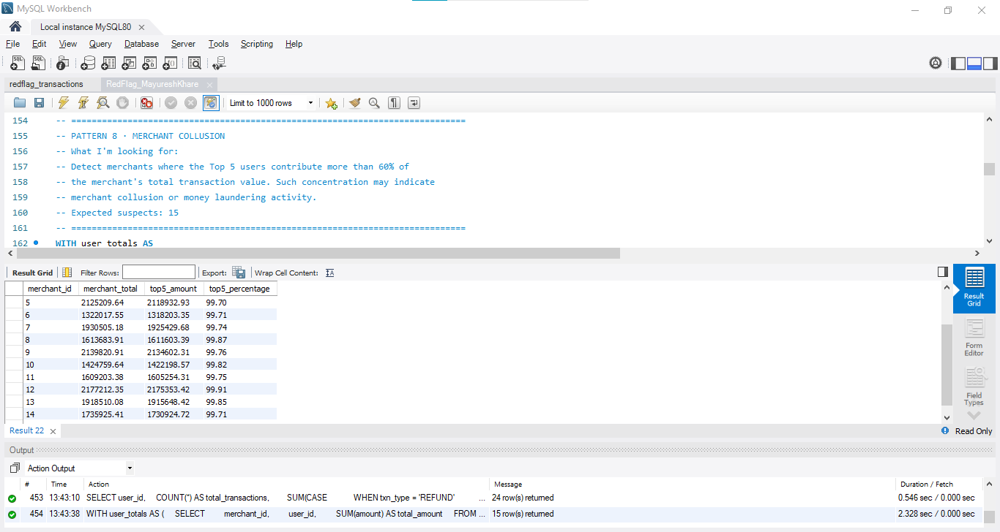
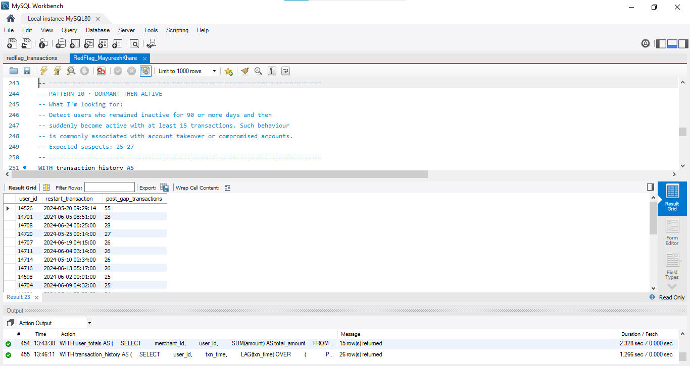
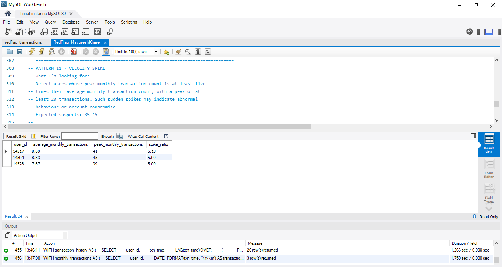
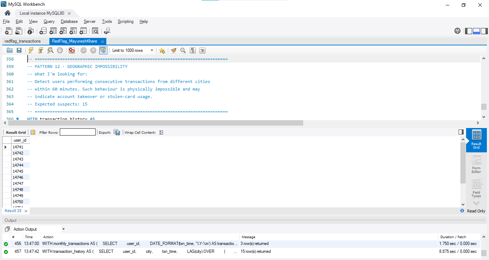

# RedFlag-Fraud-Detection-Using-SQL
SQL-based fraud detection project using 200,594 simulated payment transactions to detect 12 real-world fraud patterns.
## 📌 Project Overview

RedFlag is a SQL-based fraud detection project completed as part of **The Unlox Academy Data Analytics Program**.

The objective of this project was to detect suspicious financial activities from a simulated Indian digital payment dataset using only SQL. The project demonstrates how SQL can be used to identify fraud patterns commonly encountered in fintech and digital payment systems.

---

## 📊 Dataset Information

- **Total Transactions:** 200,594
- **Unique Users:** 14,755
- **Time Period:** January 2024 – June 2024
- **Database:** MySQL

---

## 🔍 Fraud Patterns Implemented

- ✅ Velocity Fraud
- ✅ Round Amount Clustering
- ✅ Card Testing
- ✅ Failed Transaction Abuse
- ✅ Odd Hour Concentration
- ✅ Mule Accounts
- ✅ Refund Abuse
- ✅ Merchant Collusion
- ✅ Structuring (₹9,999 Pattern)
- ✅ Dormant Then Active Accounts
- ✅ Velocity Spike
- ✅ Geographic Impossibility

---

## 🛠️ Skills Used

- SQL
- MySQL 8.0
- Common Table Expressions (CTEs)
- Window Functions
- Aggregate Functions
- CASE WHEN
- GROUP BY
- HAVING
- ROW_NUMBER()
- LAG()
- TIMESTAMPDIFF()

---

## 📁 Repository Contents

- `RedFlag_Mayuresh_Khare.sql`
- `README.md`
- `screenshots/`
  
---

## 📸 Project Screenshots
### Pattern 8 – Merchant Collusion

---

### Pattern 10 – Dormant Then Active

---

### Pattern 11 – Velocity Spike

---

### Pattern 12 – Geographic Impossibility

---

## 📌 Dataset

The original dataset is **not included** in this repository due to academy guidelines and file size limitations.

Interested reviewers may contact me for access.

---

## 👨‍💻 Author

**Mayuresh Khare**

B.Tech Computer Engineering (AI & Data Science)
